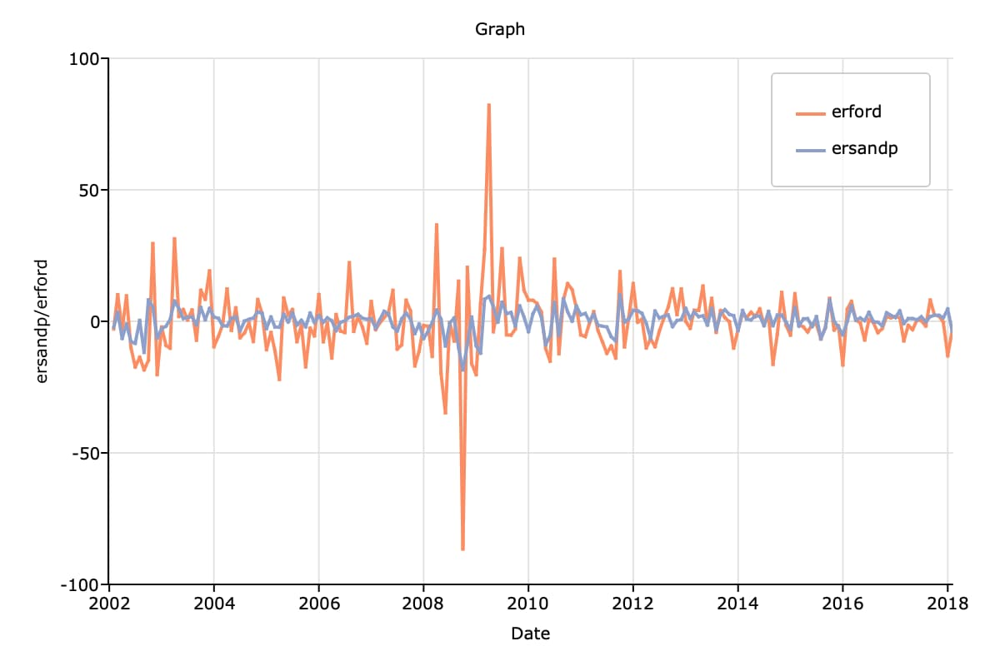
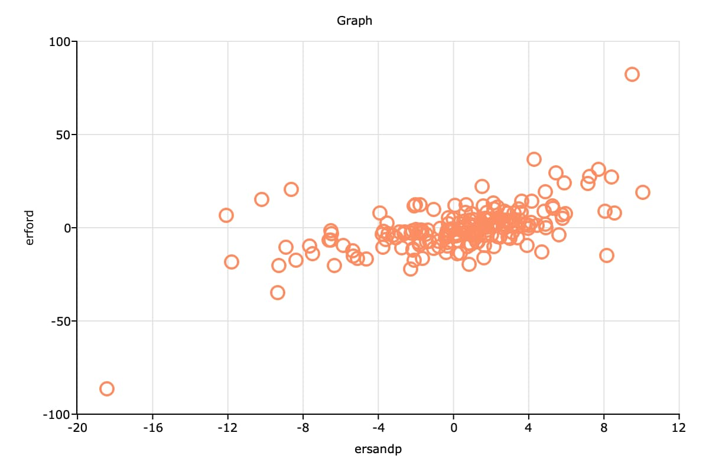

Chapter 5: Estimation and Hypothesis Testing of the CAPM
==================================================================================

Example 1: Estimate the CAPM Regression Equation
--------------------------------------------------

This example demonstrates how to estimate the model:

.. math:: (R_{Ford} - r_f)_t = \alpha + \beta(R_M - r_f)_t + u_t

Getting Started
++++++++++++++++++++++++++++++++++++++++++
To run this example on your own you will need to install the BrooksEconFinLib package. This package houses all examples and associated data.

How to
++++++++++++++++++++++++++++++++++++++++++

Step One: Load the data
^^^^^^^^^^^^^^^^^^^^^^^^^^^
To start, load the relevant variables from the dataset using :func:`loadd` and a `formula string <https://www.aptech.com/resources/tutorials/loading-variables-from-a-file/>`_.

To replicate this example, we will load the following variables:

* Date - Observation date.
* SandP - S&P 500 index.
* USTB3M - Three month T-bill yields. (Note that our data has already been converted to monthly).
* FORD - Stock prices.
* GE - Stock prices.
* MICROSOFT - Stock prices. 
* ORACLE - Stock prices.

::

    // Create file name with full path
    data_file = getGAUSSHome() $+ "pkgs/BrooksEcoFinLib/examples/capm.csv";

    // Load all variables from the CSV file
    data_org = loadd(data_file, "date(Date) + FORD + SandP + USTB3M");

    // Print the first 5 rows
    head(data_org);

::

            Date             FORD            SandP           USTB3M 
      2002-01-01        15.300000        1130.2000       0.14000000 
      2002-02-01        14.880000        1106.7300       0.14666667 
      2002-03-01        16.490000        1147.3900       0.15250000 
      2002-04-01        16.000000        1076.9200       0.14583333 
      2002-05-01        17.650000        1067.1400       0.14666667

**Further reading**: `Data management guide <https://docs.aptech.com/gauss/data-management.html>`_

**Function reference**: :func:`getGAUSSHome`, :func:`head`, :func:`loadd`

Step Two: Transform data
^^^^^^^^^^^^^^^^^^^^^^^^^^^

Our data transformation starts by defining a procedure to compute log returns and using that procedure to compute log returns of the ``SandP`` and ``FORD`` variables.

Previous versions of our ``lnDiff`` procedure removed the missing observation from the first element of the return value. This time we want to keep the missing observation, because it is more convenient to assign the entire column than a partial column.

We could just remove the call to :func:`packr` from the version of ``lnDiff`` in our previous example. However, we will use this chance to show you `how to use optional inputs to GAUSS procedures <https://www.aptech.com/blog/the-basics-of-optional-arguments-in-gauss-procedures/>`_.

::

    /*
    **  Procedure to compute log differences
    **
    ** The second input, '...', tells GAUSS
    ** that this procedure can accept extra
    ** optional inputs
    */
    proc (1) = lnDiff(x, ...);
        local x_diff, trim1;
        
        // If an optional input is passed in,
        // set 'trim1' equal to its value,
        // otherwise set trim equal to 1.
        trim1 = dynargsGet(1, 1);
        
        x_diff =  100 * ln(x ./ lagn(x, 1)); 
        
        // If 'trim1' is not equal to 0.
        if trim1;
            // Trim 1 row from the top
            // and 0 from the bottom
            x_diff = trimr(x_diff, 1, 0);
        endif;
        
        retp(x_diff);
    endp;
    
    // Create a new dataframe with the continuously
    // compounded returns of 'FORD' and 'SandP'
    trim_1 = 0;
    returns = lnDiff(data_org[., "FORD" "SandP"], trim_1);
    
    // Set the variable names
    returns = asDF(returns, "ret_ford", "ret_sandp");
    
    head(returns);

::

         ret_ford        ret_sandp
                .                .
       -2.7834799       -2.0984861
        10.273611        3.6080107
       -3.0165414       -6.3384655
        9.8147061      -0.91229691

We will finish our data preparation by computing the excess return of ``SandP`` and ``FORD`` and then combining all the variables into one dataframe named, ``data``.

::

    // Create a datframe with the excess return of 'SandP' and 'FORD', by
    // subtracting 'USTB3M' from both return variables computed above
    er = returns - data_org[.,"USTB3M"]; 

    // The excess return variables will be in the same order
    // as the return variables in 'returns'. So make sure the
    // variable names are in the right order.
    er = asDF(er, "erford", "ersandp");
    
    // Add the 'Date' and 'USTB3M' variables to the front
    // of 'data using the horizontal concatenation operator '~'.
    data = data_org[.,"Date" "USTB3M"] ~ er ~ returns;
    
    head(data);

::

            Date         ret_ford        ret_sandp           USTB3M           erford          ersandp
      2002-01-01                .                .       0.14000000                .                .
      2002-02-01       -2.7834799       -2.0984861       0.14666667       -2.9301466       -2.2451528
      2002-03-01        10.273611        3.6080107       0.15250000        10.121111        3.4555107
      2002-04-01       -3.0165414       -6.3384655       0.14583333       -3.1623748       -6.4842988
      2002-05-01        9.8147061      -0.91229691       0.14666667        9.6680394       -1.0589636

**Further reading**: 

* `Basics of GAUSS Procedures <https://www.aptech.com/blog/basics-of-gauss-procedures/>`_
* `Basics of Optional Inputs to GAUSS Procedures <https://www.aptech.com/blog/the-basics-of-optional-arguments-in-gauss-procedures/>`_

**Function reference**: :func:`asdf`, :func:`dynargsGet`, :func:`loadd`, :func:`ln`, :func:`trimr`

Step Three: Plot data
^^^^^^^^^^^^^^^^^^^^^^^^^

We can create the above time series plot with the following code:

::

    // Set size of graph
    plotCanvasSize("px", 600 | 400);

    // Declare plotControl structure
    // and fill with default settings
    struct plotControl plt;
    plt = plotGetDefaults("xy");

    plotSetYLabel(&plt, "ersandp/erford");
    plotSetTitle(&plt, "Graph");
    plotSetGrid(&plt, "on");

    // Draw the plot using a formula string
    plotXY(data, "ersandp + erford ~ Date");

The code below will create the above scatter plot.

::

    // Open a new graph window so we don't
    // overwrite the graph we just created
    plotOpenWindow();
    
    // Fill 'plt' with default settings for scatter plots
    struct plotControl plt;
    plt = plotGetDefaults("scatter");
    
    plotSetTitle(&plt, "Graph");
    plotSetGrid(&plt, "on");
    
    // Plot 'erford' vs 'ersandp' using a formula string
    plotScatter(plt, data, "erford ~ ersandp");

**Further reading**: `Basic GAUSS Graph Customization <https://www.aptech.com/resources/tutorials/basic-graph-with-programmatic-customization/>`_

**Function reference**: :func:`plotcanvassize`, :func:`plotgetdefaults`, :func:`plotOpenWindow`, :func:`plotScatter`, :func:`plotSetGrid`, :func:`plotSetTitle`, :func:`plotSetYLabel`

Step Four: Compute regression
^^^^^^^^^^^^^^^^^^^^^^^^^^^^^^^

::

    // Compute the regression:
    //     'erford = a + B*ersandp + err
    // and print results
    call olsmt(data, "erford ~ ersandp");

::

    Valid cases:                   193      Dependent variable:              erford
    Missing cases:                   1      Deletion method:               Listwise
    Total SS:                34741.345      Degrees of freedom:                 191
    R-squared:                   0.337      Rbar-squared:                     0.334
    Residual SS:             23019.606      Std error of est:                10.978
    F(1,191):                   97.258      Probability of F:                 0.000
    
                             Standard                 Prob   Standardized  Cor with
    Variable     Estimate      Error      t-value     >|t|     Estimate    Dep Var
    -------------------------------------------------------------------------------
    
    CONSTANT    -0.955984    0.793085     -1.2054     0.230       ---         ---   
    ersandp       1.88976     0.19162     9.86197     0.000    0.580862    0.580862

**Function reference**: :func:`olsmt`
