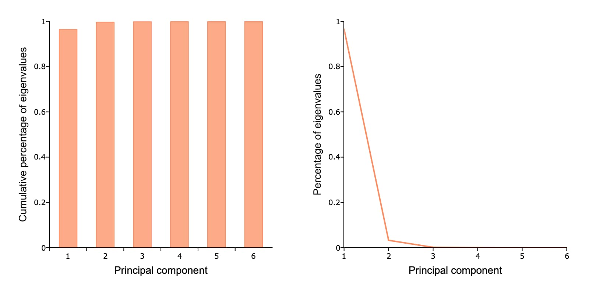

Chapter 9: Calculating Principal Components
==================================================================================

Example: PCA with US Treasuries "by hand"
--------------------------------------------------

This example demonstrates how to compute principal component analysis (PCA) to analyze US Treasury bills and bonds.

Getting Started
++++++++++++++++++++++++++++++++++++++++++
To run this example on your own you will need to install the BrooksEconFinLib package. This package houses all examples and associated data.

How to
++++++++++++++++++++++++++++++++++++++++++

Step One: Load the data
^^^^^^^^^^^^^^^^^^^^^^^^^^^
To start, load the relevant variables from the dataset using :func:`loadd` and a `formula string <https://www.aptech.com/resources/tutorials/loading-variables-from-a-file/>`_.

To replicate this example, we will load the following variables:

* Date - Observation date.
* GS3M - Market yield on 3 month US Treasury bill.
* GS6M - Market yield on 6 month US Treasury bill.
* GS1 - Market yield on 1 year US Treasury bond.
* GS3 - Market yield on 3 year US Treasury bond.
* GS5 - Market yield on 5 year US Treasury bond.
* GS10 - Market yield on 10 year US Treasury bond.

::

    // Create file name with full path
    data_set = getGAUSSHome() $+ "pkgs/BrooksEcoFinLib/examples/fred90.dta";
   
    // Load all variables from file
    data = loadd(data_set);

    // Preview first 5 rows
    head(data);

::

          Date     GS3M     GS6M      GS1      GS3      GS5     GS10
    1990-01-01   7.9000   7.9600   7.9200   8.1300   8.1200   8.2100
    1990-02-01   8.0000   8.1200   8.1100   8.3900   8.4200   8.4700
    1990-03-01   8.1700   8.2800   8.3500   8.6300   8.6000   8.5900
    1990-04-01   8.0400   8.2700   8.4000   8.7800   8.7700   8.7900
    1990-05-01   8.0100   8.1900   8.3200   8.6900   8.7400   8.7600

**Further reading**: `Data management guide <https://docs.aptech.com/gauss/data-management.html>`_

**Function reference**: :func:`getgausshome`, :func:`head`, :func:`loadd`

Step Two: Normalize the variables
^^^^^^^^^^^^^^^^^^^^^^^^^^^^^^^^^^^^^^

We need to normalize the variables by subtracting the means from each variable and dividing by the standard deviation. We will break this into several lines of code so you can look at some of the intermediate calculations.

The return values from :func:`stdc` and :func:`meanc` will be 6x1 column vectors. For us to be able to perform the element-by-element subtraction between the six elements of ``mu`` and the corresponding columns of ``yields``,  we need ``mu`` to have the same number of columns as ``yields``. That is why we transpose ``mu`` (and ``sd``) on the line that creates ``yields_norm``.

.. note: The GAUSS :func:`rescale` function is a more efficient way to scale your variables.

::

    // Create a datframe that contains
    // the yields, but not the 'Date' variable
    yields = delcols(data, "Date");

    // Compute the means and standard
    // deviations for each variable
    mu = meanc(yields);
    sd = stdc(yields);

    // Subtract the mean and divide by
    // the standard deviation for each column
    yields_norm = (yields - mu') ./ sd';

    head(yields_norm);

::

       GS3M     GS6M      GS1      GS3      GS5     GS10
     2.1723   2.1100   2.0424   1.9457   1.8806   1.8754
     2.2150   2.1773   2.1227   2.0582   2.0194   2.0114
     2.2876   2.2447   2.2240   2.1621   2.1027   2.0742
     2.2320   2.2405   2.2451   2.2271   2.1813   2.1788
     2.2192   2.2068   2.2113   2.1881   2.1675   2.1631

**Further reading**: `Element-by-element operations in GAUSS (YouTube) <https://www.aptech.com/blog/gauss-basics-5-element-by-element-conformability/>`_

**Function reference**: :func:`delcols`, :func:`meanc`, :func:`stdc`

Step Three: Compute the Principal Components
^^^^^^^^^^^^^^^^^^^^^^^^^^^^^^^^^^^^^^^^^^^^^^^

Now we will compute the estimated covariance matrix of our normalized yield variables and compute the eigenvalues and eigenvectors.

::

    // Estimate the sample covariance matrix
    yields_cov = varCovXS(yields_norm);
   
    // Compute eigenvalues and eigenvectors
    // of the covariance matrix
    { latent, coeff } = eighv(yields_cov);

    print "latent = " latent;
    print "coeff = " coeff;

::

    latent =
      0.0001
      0.0003
      0.0019
      0.0104
      0.1955
      5.7918

    coeff =
      0.2371  -0.3070   0.5395   0.4677  -0.4165   0.4078
     -0.6021   0.5065  -0.1919   0.1540  -0.3910   0.4092
      0.5424  -0.0821  -0.6255  -0.2281  -0.2938   0.4117
     -0.4177  -0.5250   0.1519  -0.5890   0.0903   0.4144
      0.3246   0.5804   0.4139  -0.2970   0.3609   0.4099
     -0.0848  -0.1732  -0.2943   0.5200   0.6700   0.3962

**Function reference**: :func:`eighv`, :func:`varcovxs`

Step Four: Rearrange and Interpret
^^^^^^^^^^^^^^^^^^^^^^^^^^^^^^^^^^^^^^

The eigenvalues and the corresponding columns of the eigenvector matrix are ordered from smallest to largest. We will reverse the order of the eigenvalues with the GAUSS `rev` function. Then we will reorder the columns of the eigenvector matrix.

::

    // Reverse the order of the eigenvalues
    latent = rev(latent);
   
    // Create the sequence 6, 5, 4,...1
    rev_idx = seqa(cols(coeff), -1, cols(coeff));
    coeff = coeff[., rev_idx];
   
    print latent;
    print coeff;

::

      5.7918
      0.1955
      0.0104
      0.0019
      0.0003
      0.0001

      0.4078  -0.4165   0.4677   0.5395  -0.3070   0.2371
      0.4092  -0.3910   0.1540  -0.1919   0.5065  -0.6021
      0.4117  -0.2938  -0.2281  -0.6255  -0.0821   0.5424
      0.4144   0.0903  -0.5890   0.1519  -0.5250  -0.4177
      0.4099   0.3609  -0.2970   0.4139   0.5804   0.3246
      0.3962   0.6700   0.5200  -0.2943  -0.1732  -0.0848

Each column of the eigenvector matrix is a different component vector. The elements in the rows of these vectors contain the weights for the corresponding variables. To make intepretation more clear, we will transpose the eigenvector matrix and add the variable names to the columns.

::

    headers = getcolnames(yields);
    coeff = setcolnames(coeff', headers);
    
    print coeff;

::
    
        GS3M     GS6M      GS1      GS3      GS5     GS10
      0.4078   0.4092   0.4117   0.4144   0.4099   0.3962
     -0.4165  -0.3910  -0.2938   0.0903   0.3609   0.6700
      0.4677   0.1540  -0.2281  -0.5890  -0.2970   0.5200
      0.5395  -0.1919  -0.6255   0.1519   0.4139  -0.2943
     -0.3070   0.5065  -0.0821  -0.5250   0.5804  -0.1732
      0.2371  -0.6021   0.5424  -0.4177   0.3246  -0.0848

**Function reference**: :func:`cols`, :func:`getcolnames`, :func:`rev`, :func:`seqa`, :func:`setcolnames`

Step Five: Compute the variance explained
^^^^^^^^^^^^^^^^^^^^^^^^^^^^^^^^^^^^^^^^^^^

We can compute the percent and cumulative percent of variance explained like this:

::

    perc_lat = latent ./ sumc(latent);

    cum_perc_lat = cumsumc(latent) ./ sumc(latent);

::
    
    perc_lat = 0.965297   cum_perc_lat = 0.965297 
               0.032580                  0.997876 
               0.001738                  0.999614 
               0.000310                  0.999924 
               0.000051                  0.999976 
               0.000024                  1.000000

To make interpretation even more clear, we will add the ``perc_lat`` variable to the front of the eigenvector matrix.

::

    // Convert 'perc_lat' to be a dataframe
    // with the column name 'VARIANCE'
    variance = asdf(perc_lat, "VARIANCE");
    
    // Use the horizontal contatenation operator
    // '~' to add variance to the front of coeff
    coeff = variance ~ coeff;
    
    print coeff;

::
    
    VARIANCE     GS3M     GS6M      GS1      GS3      GS5     GS10 
      0.9653   0.4078   0.4092   0.4117   0.4144   0.4099   0.3962 
      0.0326  -0.4165  -0.3910  -0.2938   0.0903   0.3609   0.6700 
      0.0017   0.4677   0.1540  -0.2281  -0.5890  -0.2970   0.5200 
      0.0003   0.5395  -0.1919  -0.6255   0.1519   0.4139  -0.2943 
      0.0001  -0.3070   0.5065  -0.0821  -0.5250   0.5804  -0.1732 
      0.0000   0.2371  -0.6021   0.5424  -0.4177   0.3246  -0.0848

**Function reference**: :func:`asdf`, :func:`cumsumc`, :func:`sumc`

Step Six: Plot the results
^^^^^^^^^^^^^^^^^^^^^^^^^^^^^^^^^^^^^^

Finally we will plot the explained variance for each principal component.

::

    // Set total size for both graphic panels
    plotCanvasSize("px", 800|400);
    
    // Declare 'plt' to be a plotControl structure
    struct plotControl plt;
    
    // Create the series 1, 2, 3,...6
    component_idx = seqa(1, 1, rows(perc_lat));
    
    // Split the graph canvas into a 1x2 grid and
    // place the next graph in the first location
    plotLayout(1,2,1);
    
    // Fill the plotControl structure with default values
    plt = plotGetDefaults("bar");
    
    plotSetYLabel(&plt, "Cumulative percentage of eigenvalues", "arial", 14);
    plotSetXLabel(&plt, "Principal component");
    
    plotBar(plt, component_idx, cum_perc_lat);
    
    // Split the graph canvas into a 1x2 grid and
    // place the next graph in the second location
    plotLayout(1,2,2);
    
    plt = plotGetDefaults("xy");
    
    plotSetYLabel(&plt, "Percentage of eigenvalues", "arial", 14);
    plotSetXLabel(&plt, "Principal component");
    
    // Fill the plotControl structure with default values
    plotXY(plt, component_idx, perc_lat);

**Function reference**: :func:`plotbar`, :func:`plotcanvassize`, :func:`plotgetdefaults`, :func:`plotlayout`, :func:`plotsetxlabel`, :func:`plotsetylabel`, :func:`plotxy`

**Further reading**:

* `GAUSS graphics blog posts <https://www.aptech.com/blog/category/graphics//>`_
